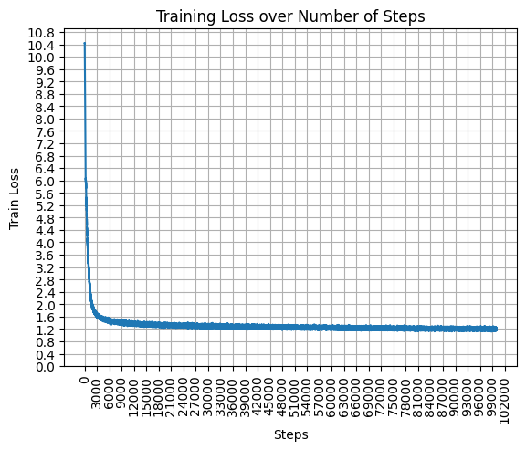

# GPT
* This repo is mainly for educational purposes, it covers a full training guide to train Language models on large datasets starting from small models and scaling it after doing some experiments on the small models
* All models were trained on a RTX 4090 GPU, brrrr.

## [Tiny Stories Dataset](https://huggingface.co/datasets/roneneldan/TinyStories)

| Model-Params       |`d_model`| `n_heads`  | `maximum_context_length` | `num_layers`  | `vocab_size` | Estimated Validation Loss   |
| :-------------:    |:-------:|:----------:|:------------------------:|:--------------|:------------:|:-------------------------:  |
| *280K*             |   64    |     8      |           512            |       5       |      512     |      **1.33**             |
| *15M*              |   288   |     6      |           256            |       6       |     32000    |      **1.19**             |
| *45M*              |   512   |     8      |           1024           |       8       |     32000    |      **TODO**               |
| *110M*             |   768   |     12     |           2048           |       12      |     32000    |      **TODO**               |

### 280K Parameter Model
* 
#### Results
* Obtained a **Validation Loss** of `1.3344` with an **accuracy** of `63%`, `:‑|`. It had a vocab size of `512`. Used `sentence_piece_512.model` for tokenizing

#### Predictions
* Don't expect much, it's a very small model. You'll see the predictions get good as the model size increases
* Prompt: `Once upon a time,` | Sampling Technique: `Greedy sampling`

    ```
    Once upon a time, there was a little boy named Tim. Tim loved to play with his toy car. One day, he saw a big box in his yard. The box was very fast. Tim wanted to play with the box.
    Tim asked his friend, Sam, "Can I play with the box?" Sam said, "Yes, I can play with the box." Sam said, "Yes, I can play with my box."
    Tim and Sam played with the box together. They played together all day. They had so much fun. Then, they found a big box. Tim and Sam were very happy. They played together all day.
    ```
* Prompt: `Once upon a time,` | Sampling Technique: `top-k = 2`

    ```
    Once upon a time, in a small house, there lived a little girl named Amy. She loved to play with her friends. One day, she went to the park with her mom and dad to play with her toys in the park.
    At the park, Amy's friend, a little boy named Tim, saw the boy. They were shy and colorful. They played together all day long, and had a fun day at the park.
    Amy and Amy played with their toys and had a lot of fun. They had so much fun playing together. Amy was very happy and played with her toys all day long. They had a lot of fun together. And they all lived happily ever after.
    ```

### 15M Parameter Model
* 

#### Results
* Obtained a **Validation Loss** of `1.19` with an accuracy of about `70%`,
It had a vocab size of `32000`. Used `sentence_piece_32000.model` for tokenizing

#### Predictions
* Predictions have difinetely improved!
* Prompt: `Once upon a time,` | Sampling Technique: `Greedy sampling`

    ```
    Once upon a time, there was a little girl named Lily. She loved to play with her toys and eat yummy food. One day, she found a big, round thing in her room. It was a microscope. Lily was very curious about it.
    Lily wanted to see what was inside the microscope. She tried to open it, but it was very hard. She tried and tried, but she could not open it. Lily felt sad and wanted to find a way to open the microscope.
    Then, Lily had an idea. She asked her mom for help. Her mom showed her how to open the microscope. Lily was so happy! She looked through the microscope and saw many tiny things. She was so excited to see the tiny things. Lily and her mom had a fun day together.
    ```
* Prompt: `Once upon a time, in a big forest, there was a fearful little dog named Spot` | Sampling Technique: `Greedy sampling`
    ```
    Once upon a time, in a big forest, there was a fearful little dog named Spot. Spot was scared of many things. One day, Spot saw a big tree with a hole in it. He thought, "I want to see what is inside the hole."
    Spot went to the tree and looked inside the hole. He saw a little bird with a hurt wing. Spot said, "I will help you, little bird." He used his paw to gently lift the bird out of the hole. The bird was very happy and said, "Thank you, Spot!"
    Spot and the bird became good friends. They played together in the forest every day. Spot learned that it is good to help others, even if they are scared of something. And they lived happily ever after.
    ```
* Prompt: `Once upon a time,` | Sampling Technique: `top_p = 0.9`

    ```
    Once upon a time, there was a little girl named Sue. Sue had a toy box full of her favorite toys. One day, she found a big, fake bear in the toy box. She was very happy and wanted to play with it all day.
    Sue took the bear out of the toy box and started to play. She threw the bear high in the air and watched it fall back down. Sue liked to count how many times the bear went up and down. She counted one, two, three, four, five, six, seven, eight, nine, ten. Sue was having so much fun counting with her new toy bear.
    But then, something unexpected happened. The fake bear started to talk! It said, "Sue, I am not a fake bear. I am a magic bear! I can make your toys come to life!" Sue was very surprised. She asked the magic bear to make her toys come to life. The magic bear made her toys come to life and play with her. Sue and her toys played together all day long.
    ```
* Prompt: `Once upon a time, in a big forest, there was a fearful little dog named Spot` | Sampling Technique: `top-k = 50`
    ```
    Once upon a time, in a big forest, there was a fearful little dog named Spot. Spot was scared of everything. One day, Spot saw a big red ball stuck in a tree. He wanted to play with the ball, but he was too scared to climb the tree.
    A kind bird named Blue saw Spot's fear and wanted to help. Blue flew up to the big red ball and pushed it with her beak. The ball fell down from the tree, and Spot was very happy.
    As the ball came down, it started to wiggle! Spot was not scared anymore. He played with the ball and had lots of fun. Spot and Blue became best friends. They played together every day, and Spot never felt alone again.
    ```

## [Tiny Shakespeare Dataset](https://homl.info/shakespeare)
### Results
* Obtained a **Validation Loss** (with 10% of the total data for validation) of **1.4939** with a character-level model (**~6 Million parameters**)

### Predictions
* Sampling technique: `Random Categorical` with `temperature=0.80`
    ```
    Second Servingman:
    The ground of Claudio take thee to his country:
    And ere I did confess too, my words is full as
    some from night once with your grace for your contract,
    So think his face have turns the liberty.

    AUTOLYCUS:
    True, do not soon did stay awhile.

    GREMIO:
    Why, I shall wish our honour.

    AUTOLYCUS:
    I think you, this honourable house:
    This guard is the licked with some fearful day.

    KING LEWIS XI:
    Well, wisely at your wisely and base this father
    In the most enough and my mistress fortune to
    like that the world I think comes here.

    DUKE VINCENTIO:
    Now, no, that will defend you, sir; yet you have
    with him and befall'n him. His worse whereof,
    Even in Vienna stand of proofs are as beshy
    To the brother comes, that in a better,
    For Rome is before his suit is an army,
    Thy soul that is dead, and must be infect.
    I come to my wit think a well widower?

    KING RICHARD II:
    Good man, sir, sir, I will say not it is.
    This is it may be, my lord,
    But I enter the way and her drop in thee.
    ...
    ```

* Sampling technique: `tok-10 sampling` with `temperature=0.8`
    ```
    DUKE VINCENTIO:
    That stabb'd me not affections,
    To thy good convenient commands to the
    sea-side, or the pleasure, of this way
    To be a man false to the fire of his wife:
    A gentle prayers of slanders of the babe.

    GLOUCESTER:
    Slander'd with a prisoner, sir; I will watch her honourable
    Of your honour, and your husband's friends,
    And his country's love, where you shall something be
    broke to the sun to see him hither. Who's the breath?
    O heavy spirits! What said with that?

    Second Murderer:
    Say thou not so high hath lost to such a word,
    To thy son, and so far as they are not by the
    people have not wash'd his hands.

    Clown:
    And when he shall through they have an enemies
    Hath not beside to die since a banish'd from
    Which the sea that hath made good curse my country;
    But what would they do mine eyes still the strength.

    KING EDWARD IV:
    Ay, a man; what means the senators from her fair,
    If she that thou spit your wedded proceeded
    His proceeding to her study: and so base her about
    In the girls of some blest of the sweet day,
    As if you look'd by this point. But stay 'twas the
    defenders of the business of your brows:
    I'll pity the flower and lose against the same.
    Thou canst give me not; the rest is out
    As sweeter please you, sir.
    ```
* Not bad for a character level model, `( ͡° ͜ʖ ͡°)`.

## Reference and Useful Links
* GPT:[[Paper Summary]](https://colab.research.google.com/drive/1d4BmKVoNGREQR2j2yv9lHORrcWS4eLgl#scrollTo=AP2x1jC9-319) [[Arxiv Paper]](https://s3-us-west-2.amazonaws.com/openai-assets/research-covers/language-unsupervised/language_understanding_paper.pdf)
* GPT-2:[[Paper Summary]](https://colab.research.google.com/drive/1d4BmKVoNGREQR2j2yv9lHORrcWS4eLgl#scrollTo=yHOofcd8Jajj) [[Arxiv paper]](https://d4mucfpksywv.cloudfront.net/better-language-models/language-models.pdf)
* GPT-3 [[Paper Summary]](https://colab.research.google.com/drive/1d4BmKVoNGREQR2j2yv9lHORrcWS4eLgl#scrollTo=mlHE3Xmjo290) [[Arxiv Paper]](https://arxiv.org/pdf/2005.14165.pdf)
* GPT-4: Multimodal Model, not open-sourced by OpenAI
* Also check out my Transformer repo [Attention-Is-All-You-Need](https://github.com/VachanVY/Attention-Is-All-You-Need)
