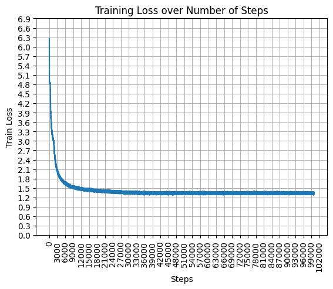

# GPT
* This repo is mainly for educational purposes, it covers a full training guide to train Language models on large datasets starting from small models and scaling it after doing some experiments on the small models

## [Tiny Stories Dataset](https://huggingface.co/datasets/roneneldan/TinyStories)

| Model-Params       | Estimated Validation Loss   |
| -------------      |:-------------------------:  |
| *280K*             | **1.3343**                  |
| *15M*              | **Training...**             |
| *45M*              | **TODO**                    |
| *110M*             | **TODO**                    |

### 280K Parameter Model
* 
#### Results
* Obtained **Validation Loss** of `1.3343884` with an **accuracy** of `63%`, `:‑|`. It had a vocab size of `512`. Used `sentence_piece_512.model` for tokenizing

#### Predictions
* Don't expect much, it's a very small model. You'll see the predictions get good as the model size increases
* Prompt: `Once upon a time,`; Sampling Technique: `Greedy sampling`

    ```
    Once upon a time, there was a little boy named Tim. Tim loved to play with his toy car. One day, he saw a big box in his yard. The box was very fast. Tim wanted to play with the box.
    Tim asked his friend, Sam, "Can I play with the box?" Sam said, "Yes, I can play with the box." Sam said, "Yes, I can play with my box."
    Tim and Sam played with the box together. They played together all day. They had so much fun. Then, they found a big box. Tim and Sam were very happy. They played together all day.
    ```
* Prompt: `Once upon a time,`; Sampling Technique: `top-2`

    ```
    Once upon a time, in a small house, there lived a little girl named Amy. She loved to play with her friends. One day, she went to the park with her mom and dad to play with her toys in the park.
    At the park, Amy's friend, a little boy named Tim, saw the boy. They were shy and colorful. They played together all day long, and had a fun day at the park.
    Amy and Amy played with their toys and had a lot of fun. They had so much fun playing together. Amy was very happy and played with her toys all day long. They had a lot of fun together. And they all lived happily ever after.
    ```

## [Tiny Shakespeare Dataset](https://homl.info/shakespeare)
### Results
* Obtained a **Validation Loss** (with 10% of the total data for validation) of **1.4939** with a character-level model (**~6 Million parameters**)

### Predictions
* Sampling technique: `Random Categorical` with `temperature=0.80`
    ```
    Second Servingman:
    The ground of Claudio take thee to his country:
    And ere I did confess too, my words is full as
    some from night once with your grace for your contract,
    So think his face have turns the liberty.

    AUTOLYCUS:
    True, do not soon did stay awhile.

    GREMIO:
    Why, I shall wish our honour.

    AUTOLYCUS:
    I think you, this honourable house:
    This guard is the licked with some fearful day.

    KING LEWIS XI:
    Well, wisely at your wisely and base this father
    In the most enough and my mistress fortune to
    like that the world I think comes here.

    DUKE VINCENTIO:
    Now, no, that will defend you, sir; yet you have
    with him and befall'n him. His worse whereof,
    Even in Vienna stand of proofs are as beshy
    To the brother comes, that in a better,
    For Rome is before his suit is an army,
    Thy soul that is dead, and must be infect.
    I come to my wit think a well widower?

    KING RICHARD II:
    Good man, sir, sir, I will say not it is.
    This is it may be, my lord,
    But I enter the way and her drop in thee.
    ...
    ```

* Sampling technique: `tok-10 sampling` with `temperature=0.8`
    ```
    DUKE VINCENTIO:
    That stabb'd me not affections,
    To thy good convenient commands to the
    sea-side, or the pleasure, of this way
    To be a man false to the fire of his wife:
    A gentle prayers of slanders of the babe.

    GLOUCESTER:
    Slander'd with a prisoner, sir; I will watch her honourable
    Of your honour, and your husband's friends,
    And his country's love, where you shall something be
    broke to the sun to see him hither. Who's the breath?
    O heavy spirits! What said with that?

    Second Murderer:
    Say thou not so high hath lost to such a word,
    To thy son, and so far as they are not by the
    people have not wash'd his hands.

    Clown:
    And when he shall through they have an enemies
    Hath not beside to die since a banish'd from
    Which the sea that hath made good curse my country;
    But what would they do mine eyes still the strength.

    KING EDWARD IV:
    Ay, a man; what means the senators from her fair,
    If she that thou spit your wedded proceeded
    His proceeding to her study: and so base her about
    In the girls of some blest of the sweet day,
    As if you look'd by this point. But stay 'twas the
    defenders of the business of your brows:
    I'll pity the flower and lose against the same.
    Thou canst give me not; the rest is out
    As sweeter please you, sir.
    ```
* Not bad for a character level model, `( ͡° ͜ʖ ͡°)`.

## Reference and Useful Links
* GPT:[[Paper Summary]](https://colab.research.google.com/drive/1d4BmKVoNGREQR2j2yv9lHORrcWS4eLgl#scrollTo=AP2x1jC9-319) [[Arxiv Paper]](https://s3-us-west-2.amazonaws.com/openai-assets/research-covers/language-unsupervised/language_understanding_paper.pdf)
* GPT-2:[[Paper Summary]](https://colab.research.google.com/drive/1d4BmKVoNGREQR2j2yv9lHORrcWS4eLgl#scrollTo=yHOofcd8Jajj) [[Arxiv paper]](https://d4mucfpksywv.cloudfront.net/better-language-models/language-models.pdf)
* GPT-3 [[Paper Summary]](https://colab.research.google.com/drive/1d4BmKVoNGREQR2j2yv9lHORrcWS4eLgl#scrollTo=mlHE3Xmjo290) [[Arxiv Paper]](https://arxiv.org/pdf/2005.14165.pdf)
* GPT-4: Multimodal Model, not open-sourced by OpenAI
* Also check out my Transformer repo [Attention-Is-All-You-Need](https://github.com/VachanVY/Attention-Is-All-You-Need)
